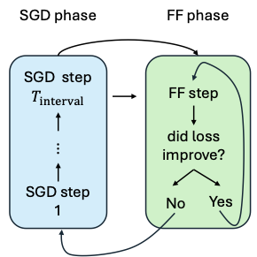
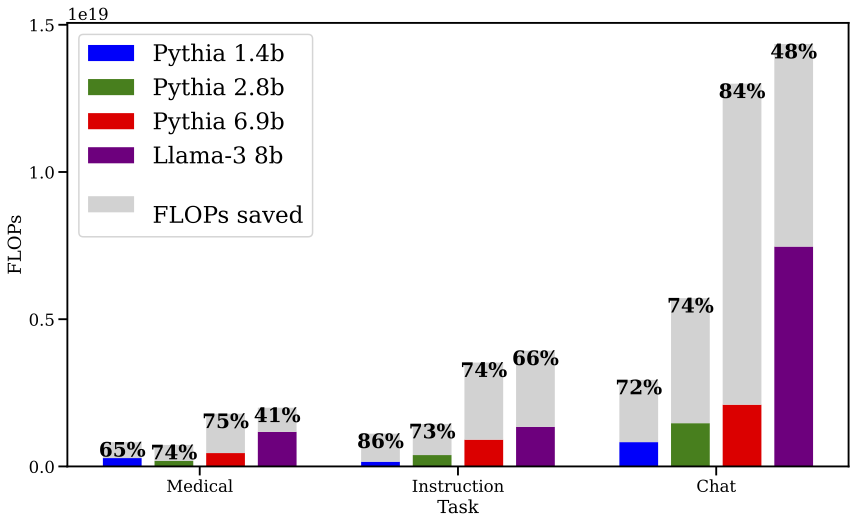
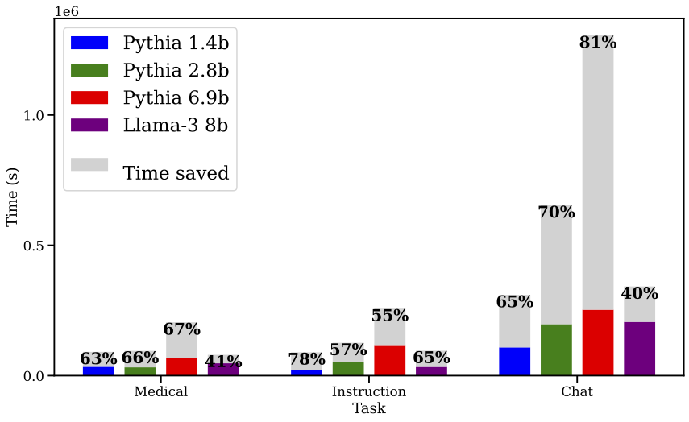

# Fast Forwarding Low-Rank Training
*Accepted as a conference paper for EMNLP 2024*
<p align="center">

</p>

Code for reproducing results from the paper [Fast Forwarding Low-Rank Training](https://arxiv.org/abs/2409.04206).

## Abstract
Parameter efficient finetuning methods like low-rank adaptation (LoRA) aim to reduce the computational costs of finetuning pretrained Language Models (LMs). Enabled by these low-rank settings, we propose an even more efficient optimization strategy: Fast Forward, a simple and effective approach to accelerate large segments of training. In a Fast Forward stage, we repeat the most recent optimizer step until the loss stops improving on a tiny validation set. By alternating between regular optimization steps and Fast Forward stages, Fast Forward provides up to an 87% reduction in FLOPs and up to an 81% reduction in train time over standard SGD with Adam. We validate Fast Forward by finetuning various models on different tasks and demonstrate that it speeds up training without compromising model performance. Additionally, we analyze when and how to apply Fast Forward.

## Dependencies Setup

Install the required libraries by running `pip install -r requirements.txt`.

## Training

Run the following command to run a train with Fast Forward:

`python main.py --task <task> --model_name <model_name> --lr <lr> --accumulation_steps <accumulation_steps> --batch_size <batch_size> --eval_batch_size<eval_batch_size> --tokenizer_max_length <tokenizer_max_length> --lora_rank <lora_rank> --lora_alpha <lora_alpha> --flops_profiler <flops_profiler> --flops_profiler <flops_profiler> --use_dora <use_dora>` 

## Useful Arguments
* **task**: The task to train the model on. Can be one of - chat, instruction and medical.
* **model_name**: The name of the model (from Huggingface) on which to perform the training. Current supported models are - Pythia 1.4b/2.8b/6.9b and Llama-3 8b models.
* **fast-forward**: If True, training with fast forward.
* **flops_profiler**: Whether to perform flops counting or not.
* **use_dora**: If True, finetuning is performed using DoRA. Otherwise, LoRA is used.

## Main Results




*Fast Forward accelerates training across low rank methods, in all three datasets and all four models.*


## References and Acknowledgements
```
@inproceedings{rahamim2024fast,
  title={Fast Forwarding Low-Rank Training},
  author={Rahamim, Adir and Saphra, Naomi and Kangaslahti, Sara and Belinkov, Yonatan},
  booktitle={Proceedings of the 2024 Conference on Empirical Methods in Natural Language Processing},
  year={2024}
}
```
